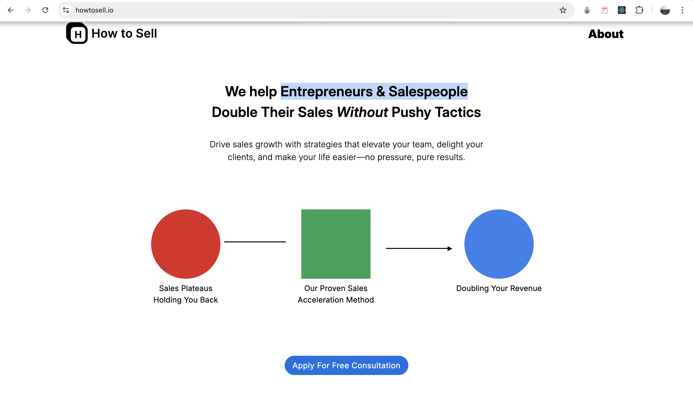
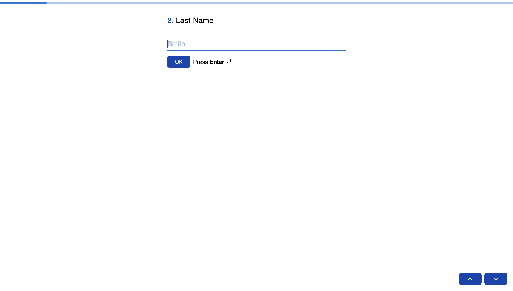
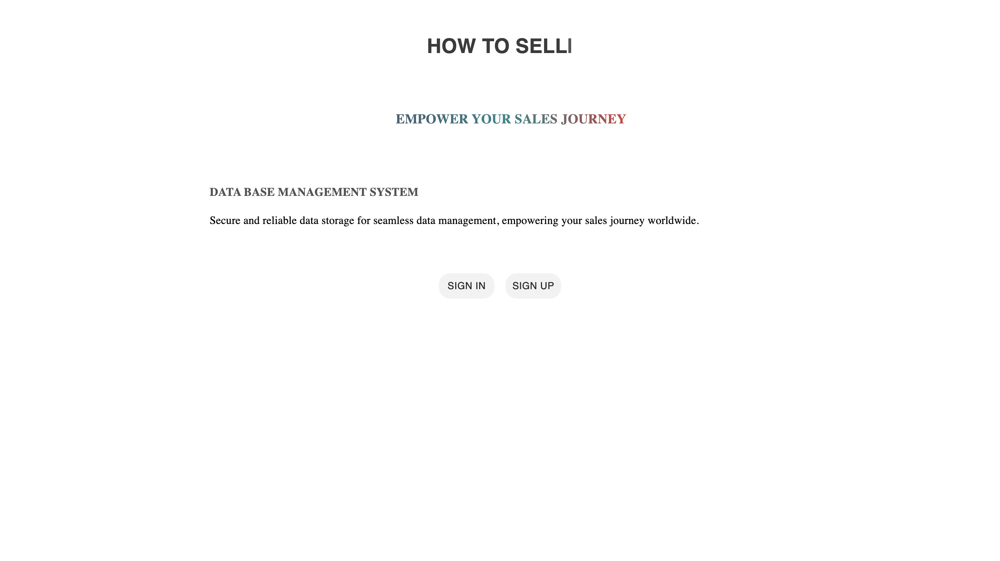
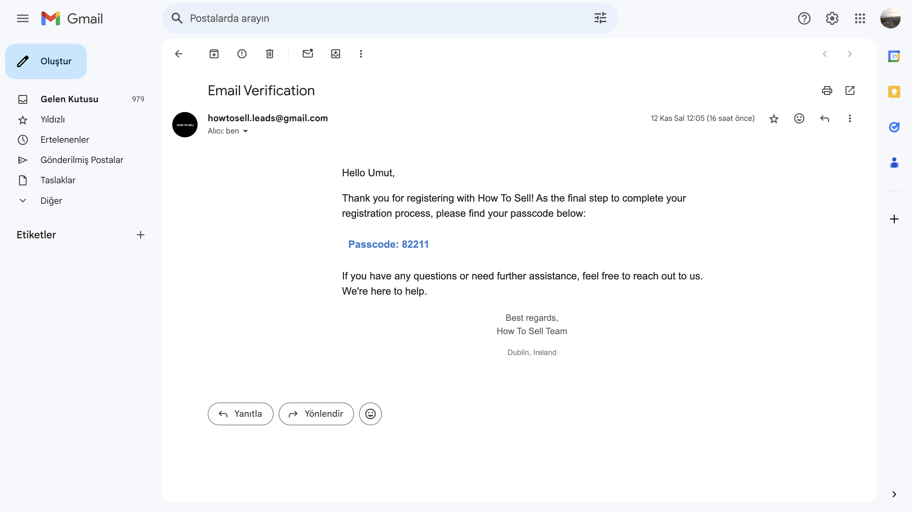
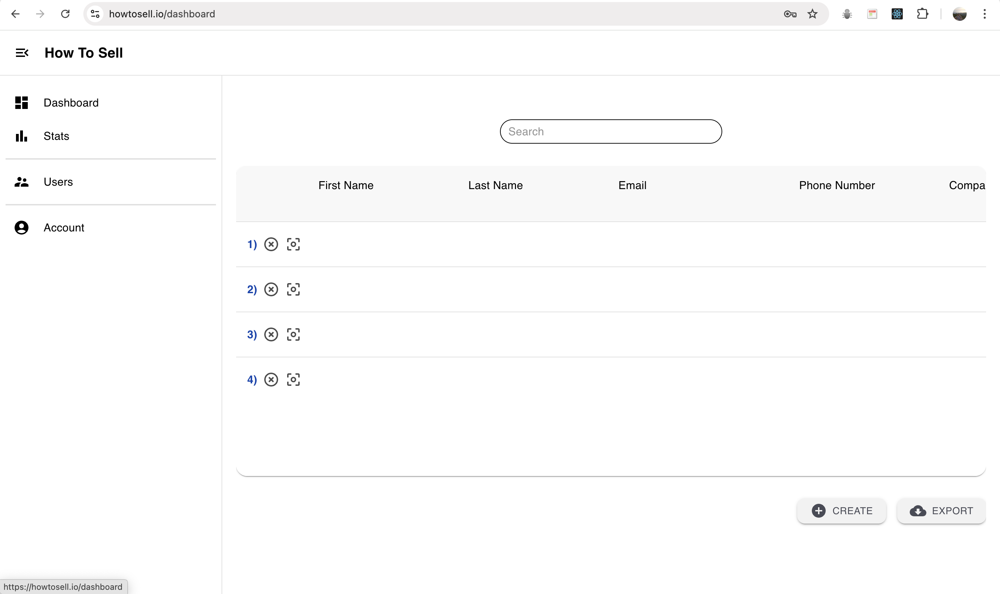
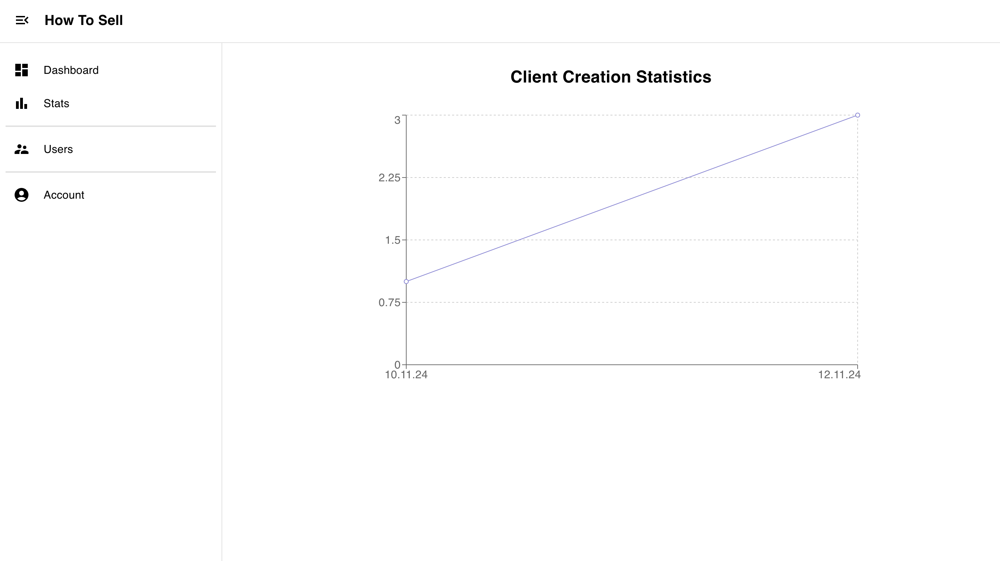

# How To Sell

 I developed a single-page application called "How to Sell" using the MERN stack (MongoDB, Express, React, Node.js) and linked it to a domain. I collaborated with designers on Fiverr to create a sleek and user-friendly interface. To enhance user experience, I integrated Typeform for easy customer data collection. For secure user authentication, including sign-up, sign-in, and password recovery features, I utilized Nodemailer to ensure safe and reliable email communication. Additionally, I created a backend application to handle efficient data management.
  

<b

 

# Main Web Page

 a. App is linked on a domain.  

 b. You can submit a form (Typeform Clone).  

# Database

## 1. Sign up

 a. Fill the required information to sign up or sign in.   

 

 b. To sign up, confirm your email by entering the code sent to your email before the time expires.  

 

 c. After logging in, you can view all the data submitted through the forms.
  

 d. You can also see a graphical representation of how many forms have been submitted day by day.
  

  
Feel free to contact me for future projects:

  

    

  

 
  

